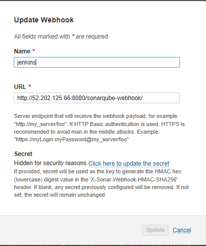

# 🚀 **Zomato App Deployment with DevOps**

This project showcases the deployment of a Zomato-style application using a modern DevOps pipeline. It integrates CI/CD, security scanning, containerization, and monitoring to ensure a seamless and secure deployment.

## 🛠️ Tools & Services Used:

1. **GitHub** 
2. **Jenkins** 
3. **SonarQube** 
4. **Docker** 
5. **Kubernetes** 
6. **Prometheus** 
7. **Grafana** 
8. **ArgoCD** 
9. **OWASP** 
10. **Trivy** 

The Jenkins automation pipeline automates building, testing, security scanning, and deploying the application, ensuring reliability and efficiency in production environments.

---

## 🔹 Infra Build and tools prerequisites

## Step 1 — Launch AWS Infrastructure
- Launch an **Ubuntu 22.04 T2 Large**  with an elastic IP associated with the VM (to have the same public IP incase of mutiple restarts)

## Step 2 — Installtion of Jenkins, docker and trivy

**Jenkins**
 is an open-source automation server used for CI/CD (Continuous Integration/Continuous Deployment). It automates the build, test, and deployment process of software development and integrates with various tools like Git, Docker, Kubernetes, and Trivy.

```sh
vi jenkins.sh

#!/bin/bash
sudo apt update -y
#sudo apt upgrade -y
wget -O - https://packages.adoptium.net/artifactory/api/gpg/key/public | tee /etc/apt/keyrings/adoptium.asc
echo "deb [signed-by=/etc/apt/keyrings/adoptium.asc] https://packages.adoptium.net/artifactory/deb $(awk -F= '/^VERSION_CODENAME/{print$2}' /etc/os-release) main" | tee /etc/apt/sources.list.d/adoptium.list
sudo apt update -y
sudo apt install temurin-17-jdk -y
/usr/bin/java --version
curl -fsSL https://pkg.jenkins.io/debian-stable/jenkins.io-2023.key | sudo tee \
                  /usr/share/keyrings/jenkins-keyring.asc > /dev/null
echo deb [signed-by=/usr/share/keyrings/jenkins-keyring.asc] \
                  https://pkg.jenkins.io/debian-stable binary/ | sudo tee \
                              /etc/apt/sources.list.d/jenkins.list > /dev/null
sudo apt-get update -y
sudo apt-get install jenkins -y
sudo systemctl start jenkins
sudo systemctl status jenkins

sudo chmod 777 jenkins.sh
./jenkins.sh    # this will installl jenkins

```

- After installing Jenkins, update your AWS EC2 Security Group to allow inbound traffic on port 8080, as      Jenkins operates on this port.
- Access the application by entering your EC2 Public IP Address followed by port 8080.
```sh

 http://<<EC2-PublicIP>>:8080/

```
- Jenkins Dashboard view


**Docker**
 is a containerization platform that allows developers to package applications and dependencies into lightweight, portable containers. It enables efficient deployment, scaling, and management of applications in different environments.

```sh
vi docker.sh

sudo apt-get update
sudo apt-get install docker.io -y
sudo usermod -aG docker $USER   #my case is ubuntu
newgrp docker
sudo chmod 777 /var/run/docker.sock

```
**SonarQube**
 is a continuous code quality and security analysis tool that detects bugs, vulnerabilities, and code smells in source code. It integrates with CI/CD pipelines and supports multiple programming languages.

- After installing Docker, deploy a SonarQube container (ensure port 9000 is open in the security group).

```sh
docker run -d --name sonar -p 9000:9000 sonarqube:lts-community

```
- Sonarqube Dashboard view


**Trivy** 
 is an open-source vulnerability scanner for containers, file systems, and code repositories. It detects vulnerabilities, misconfigurations, and exposed secrets. It is widely used in DevOps pipelines for security compliance.

```sh
vi trivy.sh

sudo apt-get install wget apt-transport-https gnupg lsb-release -y
wget -qO - https://aquasecurity.github.io/trivy-repo/deb/public.key | gpg --dearmor | sudo tee /usr/share/keyrings/trivy.gpg > /dev/null
echo "deb [signed-by=/usr/share/keyrings/trivy.gpg] https://aquasecurity.github.io/trivy-repo/deb $(lsb_release -sc) main" | sudo tee -a /etc/apt/sources.list.d/trivy.list
sudo apt-get update
sudo apt-get install trivy -y

```
## 🔹 Monitoring Tools installation

## Step 1 — Installing Prometheus
- Launch an **Ubuntu 22.04 T2 Large**  with an elastic IP associated with the VM (to have the same public IP incase of mutiple restarts)

**Prometheus** 
 is an open-source monitoring and alerting tool designed for recording real-time metrics in a time-series database. It is widely used for infrastructure monitoring, particularly in cloud environments and Kubernetes clusters.

To ensure Prometheus runs efficiently as a background service, we will:

- Create a dedicated system user for Prometheus.
- Download and configure Prometheus.
- Set up a systemd service to manage Prometheus automatically.

To run Prometheus with restricted privileges, we create a dedicated Linux user:

```sh
sudo useradd --system --no-create-home --shell /bin/false prometheus
```
This prevents Prometheus from logging into the system and enhances security.

Extract Prometheus files, move them, and create directories:

```sh
tar -xvf prometheus-2.47.1.linux-amd64.tar.gz
cd prometheus-2.47.1.linux-amd64/
sudo mkdir -p /data /etc/prometheus
sudo mv prometheus promtool /usr/local/bin/
sudo mv consoles/ console_libraries/ /etc/prometheus/
sudo mv prometheus.yml /etc/prometheus/prometheus.yml
```

To ensure Prometheus has the correct permissions, set ownership for the configuration and data directories:

```sh
sudo chown -R prometheus:prometheus /etc/prometheus/ /data/
```

To manage Prometheus as a background service, we define a systemd unit file:

```sh
sudo nano /etc/systemd/system/prometheus.service

[Unit]
# Description of the service
Description=Prometheus  

# Ensures Prometheus starts after the network is available
Wants=network-online.target  
After=network-online.target  

# Service restart settings
StartLimitIntervalSec=500  
StartLimitBurst=5  

[Service]
# Run Prometheus as the prometheus user
User=prometheus  
Group=prometheus  

# Run the service as a simple process
Type=simple  

# Restart settings in case of failure
Restart=on-failure  
RestartSec=5s  

# Command to start Prometheus with required configurations
ExecStart=/usr/local/bin/prometheus \  
  --config.file=/etc/prometheus/prometheus.yml \  # Specify the configuration file
  --storage.tsdb.path=/data \  # Define the directory to store time-series data
  --web.console.templates=/etc/prometheus/consoles \  # Location for web console templates
  --web.console.libraries=/etc/prometheus/console_libraries \  # Console libraries
  --web.listen-address=0.0.0.0:9090 \  # Listen on all network interfaces on port 9090
  --web.enable-lifecycle  # Enable API-based management  

[Install]
# Ensure the service starts on boot
WantedBy=multi-user.target  

# Enable Prometheus to start on system boot
sudo systemctl enable prometheus  

# Start the Prometheus service
sudo systemctl start prometheus  

# Check the status of the Prometheus service
sudo systemctl status prometheus  

```
Access Prometheus in a web browser using the server's IP and port 9090:


- Prometheus Dashboard view

We can see the local host present as the data source which is up and running on port 9090


## Step 2 — Installing Node Exporter

**Node Exporter** 

 is an essential component of Prometheus-based monitoring. It is a lightweight agent that collects and exposes system-level metrics from a Linux server, making them available for Prometheus to scrape and analyze.

```sh
# Create a dedicated system user for Node Exporter without a home directory or login shell
sudo useradd --system --no-create-home --shell /bin/false node_exporter  

# Download the latest Node Exporter package
wget https://github.com/prometheus/node_exporter/releases/download/v1.6.1/node_exporter-1.6.1.linux-amd64.tar.gz  

# Extract the downloaded archive
tar -xvf node_exporter-1.6.1.linux-amd64.tar.gz  

# Move the Node Exporter binary to a system-wide location
sudo mv node_exporter-1.6.1.linux-amd64/node_exporter /usr/local/bin/  

# Remove the extracted files to clean up unnecessary data
rm -rf node_exporter*  

# Create a systemd service file to manage Node Exporter as a system service
sudo nano /etc/systemd/system/node_exporter.service  

```
## Step 3 — Integrating Jenkins and NodeExporter with Prometheus

Integrating Jenkins with Prometheus to monitor the CI/CD pipeline.

To enable Prometheus to scrape metrics from both Node Exporter and Jenkins, update the prometheus.yml configuration file as shown below:

```sh
sudo cat /etc/prometheus/prometheus.yml

# my global config
global:
  scrape_interval: 15s # Set the scrape interval to every 15 seconds. Default is every 1 minute.
  evaluation_interval: 15s # Evaluate rules every 15 seconds. The default is every 1 minute.
  # scrape_timeout is set to the global default (10s).

# Alertmanager configuration
alerting:
  alertmanagers:
    - static_configs:
        - targets:
          # - alertmanager:9093

# Load rules once and periodically evaluate them according to the global 'evaluation_interval'.
rule_files:
  # - "first_rules.yml"
  # - "second_rules.yml"

# A scrape configuration containing exactly one endpoint to scrape:
# Here it's Prometheus itself.
scrape_configs:
  # The job name is added as a label `job=<job_name>` to any timeseries scraped from this config.
  - job_name: "prometheus"

    # metrics_path defaults to '/metrics'
    # scheme defaults to 'http'.

    static_configs:
      - targets: ["localhost:9090"]

  - job_name: "node_export"
    static_configs:
      - targets: ["localhost:9100"]
  - job_name: "jenkins"
    metrics_path: "/prometheus"
    static_configs:
      - targets: ["<your-jenkins-ip>:8080"]

```
Run the following command to check if the configuration file is correctly formatted:

```sh
promtool check config /etc/prometheus/prometheus.yml
```

Instead of restarting the Prometheus service, apply the new configuration dynamically:

```sh
curl -X POST http://localhost:9090/-/reload
```

Installing the Prometheus plugin in Jenkins is required to enable metric scraping by Prometheus.


We can verify that the targets are healthy and visible on the Prometheus application

```sh
http://<ip>:9090/targets
```


## Step 2 — Installing Grafana

**Grafana** 

 is essential for visualizing and analyzing metrics collected by Prometheus from Jenkins and Node Exporter. While Prometheus efficiently gathers and stores time-series data, its built-in UI is limited in terms of visualization. Grafana enhances monitoring by providing interactive dashboards, real-time graphs, and alerts, making it easier to track system performance. It allows users to customize views, correlate metrics, and receive notifications based on predefined thresholds. By integrating Grafana into our setup, we create a complete monitoring solution where Prometheus handles data collection, and Grafana presents that data in an intuitive and insightful manner for better decision-making and troubleshooting.


``` sh

# Install Dependencies
First, ensure that all necessary dependencies are installed:

sudo apt-get update
sudo apt-get install -y apt-transport-https software-properties-common

# Add the GPG Key
Add the GPG key for Grafana:

wget -q -O - https://packages.grafana.com/gpg.key | sudo apt-key add -

# Add Grafana Repository
Add the repository for Grafana stable releases:

echo "deb https://packages.grafana.com/oss/deb stable main" | sudo tee -a /etc/apt/sources.list.d/grafana.list

# Update and Install Grafana
Update the package list and install Grafana:

sudo apt-get update
sudo apt-get -y install grafana

# Enable and Start Grafana Service
To automatically start Grafana after a reboot, enable the service:

sudo systemctl enable grafana-server

Then, start Grafana:

sudo systemctl start grafana-server

# Check Grafana Status
Verify the status of the Grafana service to ensure it's running correctly:

sudo systemctl status grafana-server

# Step 7: Access Grafana Web Interface
To access Grafana, open your web browser and enter your server's IP address followed by port 3000:

http://<your-server-ip>:3000

When the login screen appears, use the default credentials:

- Username: admin
- Password: admin

# Change the Default Password
Upon first login, Grafana will ask you to change the default password. Follow the prompts to set a secure password before proceeding.

# Add Prometheus Data Source

To visualize metrics in Grafana, you need to add Prometheus as a data source:

1. Click on the ⚙️ (gear icon) in the left sidebar to open Configuration.
2. Navigate to Data Sources and click Add data source.
3. Click on the "Add data source" button.
4. Choose Prometheus from the list.
5. Under the HTTP section, set the URL to http://localhost:9090 (assuming Prometheus is running on the same  machine).
6. Click Save & Test to verify the connection.


# Import a Dashboard
To make it easier to view metrics, you can import a pre-configured dashboard:

1. Click on the + (plus icon) in the left sidebar and select Dashboard.
2. Choose the Import option.
3. Enter the dashboard ID (e.g., 1860) and click Load.
4. Select Prometheus as the data source..
5. Click the "Load" button.
6. Click on the "Import" button.

You should now have a Grafana dashboard set up to visualize metrics from Prometheus.

# Configure Prometheus Plugin Integration

To monitor your CI/CD pipeline, configure Jenkins to work with Prometheus by enabling the appropriate plugins and setting up metric collection. This will allow you to track build performance, resource usage, and system health effectively.

```


- Prometheus server monitoring over grafana


- Jenkins Job monitoring over grafana


## Step 2 — Email Integration With Jenkins and Plugin Setup

Setting up email notifications in Jenkins for pipeline job status

- Install Email Extension Plugin in Jenkins


- Go to your Gmail and click on your profile and generate app password

- Once the plugin is installed in Jenkins, click on manage Jenkins –> configure system there under the E-mail Notification section configure the details as shown in the below image


Click on Manage Jenkins–> credentials and add your mail username and generated app password


- Now under the Extended E-mail Notification section configure the details as shown in the below images


Now, we will receive notifications for every successful and failed build in Jenkins via Gmail, ensuring effective 24/7 monitoring.

- The following pipeline job will ensure that we receive an email with the Trivy FS image scan details, including the attached report.

```sh

post {
    always {
        emailext attachLog: true,
            subject: "'${currentBuild.result}'",
            body: """
                <html>
                <body>
                    <div style="background-color: #FFA07A; padding: 10px; margin-bottom: 10px;">
                        <p style="color: white; font-weight: bold;">Project: ${env.JOB_NAME}</p>
                    </div>
                    <div style="background-color: #90EE90; padding: 10px; margin-bottom: 10px;">
                        <p style="color: white; font-weight: bold;">Build Number: ${env.BUILD_NUMBER}</p>
                    </div>
                    <div style="background-color: #87CEEB; padding: 10px; margin-bottom: 10px;">
                        <p style="color: white; font-weight: bold;">URL: ${env.BUILD_URL}</p>
                    </div>
                </body>
                </html>
            """,
            to: 'sarthakmamgain44@gmail.com',
            mimeType: 'text/html',
            attachmentsPattern: 'trivy.txt'
        }
    }

```

## 🔹 Plugins Tools installation on Jenkins like JDK, Sonarqube Scanner, NodeJs, OWASP Dependency Check

## Step 1 Install below plugins

- SonarQube Scanner (Install without restart)
- NodeJs Plugin (Install Without restart)
- Eclipse Temurin Installer (Install without restart)

## Step 2 Configure Java and Nodejs in Global Tool Configuration

- Goto Manage Jenkins → Tools → Install JDK(17) and NodeJs(23)→ Click on Apply and Save


## Step 3 Configure Sonar Server in Manage Jenkins

- Grab the Public IP Address of your EC2 Instance, Sonarqube works on Port 9000, so <Public IP>:9000. Goto your Sonarqube Server. Click on Administration → Security → Users → Click on Tokens and Update Token → Give it a name → and click on Generate Token


Goto Jenkins Dashboard → Manage Jenkins → Credentials → Add Secret Text. It should look like this


- Now, go to Dashboard → Manage Jenkins → System and Add like the below image. Here we will be adding the sonarqube server ip address with the designated port number (9000)


The Configure System option is used in Jenkins to configure different server

Global Tool Configuration is used to configure different tools that we install using Plugins

- We will install a sonar scanner in the tools.


In the Sonarqube Dashboard add a quality gate also

Administration–> Configuration–>Webhooks



## Step 4  Install OWASP Dependency Check Plugins

- OWASP Dependency Check is a security tool that helps identify vulnerable dependencies in your project. It scans your project's dependencies (third-party libraries) and checks them against publicly known vulnerabilities in the National Vulnerability Database (NVD).

- GotoDashboard → Manage Jenkins → Plugins → OWASP Dependency-Check. Click on it and install it without restart.


First, we configured the Plugin and next, we had to configure the Tool

Goto Dashboard → Manage Jenkins → Tools →


## Step 5  Docker Image Build and Push

**Docker**

 is an open-source platform that allows developers to build, package, and run applications in lightweight, portable containers. It eliminates compatibility issues by bundling applications with all their dependencies, ensuring consistency across different environments. Docker enables efficient resource utilization, rapid deployment, and scalability, making it a key tool for modern DevOps and cloud-native applications.

We need to install the Docker tool in our system, Goto Dashboard → Manage Plugins → Available plugins → Search for Docker and install these plugins

Docker, Docker Common, Docker Pipeline, Docker API, docker-build-step

Add DockerHub Username and Password under Global Credentials


**Docker Scout**

is a security and insights tool that helps developers assess container images for vulnerabilities, security risks, and best practices.

Why is Docker Scout needed?

🛡️ Security Analysis: Scans container images for CVEs (Common Vulnerabilities and Exposures).
📊 Dependency Insights: Identifies outdated dependencies and potential risks.
🔍 Best Practices: Provides recommendations to improve image security and efficiency.
🚀 Continuous Security: Ensures images meet security standards before deployment.

## Step 5  With all plugins installed, now we can run the pipeline

``` sh

pipeline {
    agent any
    tools {
        jdk 'jdk17'
        nodejs 'node23'
    }
    environment {
        SCANNER_HOME=tool 'sonar-scanner'
    }
    stages {
        stage ("clean workspace") {
            steps {
                cleanWs()
            }
        }
        stage ("Git Checkout") {
            steps {
                git 'https://github.com/Sarthak221198/Zomato-Clone-DevSecOps.git'
            }
        }
        stage("Sonarqube Analysis"){
            steps{
                withSonarQubeEnv('sonar-server') {
                    sh ''' $SCANNER_HOME/bin/sonar-scanner -Dsonar.projectName=zomato \
                    -Dsonar.projectKey=zomato '''
                }
            }
        }
        stage("Code Quality Gate"){
           steps {
                script {
                    waitForQualityGate abortPipeline: false, credentialsId: 'Sonar-token' 
                }
            } 
        }
        stage("Install NPM Dependencies") {
            steps {
                sh "npm install"
            }
        }
        stage('OWASP FS SCAN') {
            steps {
                dependencyCheck additionalArguments: '--scan ./ --disableYarnAudit --disableNodeAudit', odcInstallation: 'DP-Check'
                dependencyCheckPublisher pattern: '**/dependency-check-report.xml'
    }
}
        stage ("Trivy File Scan") {
            steps {
                sh "trivy fs . > trivy.txt"
            }
        }
        stage ("Build Docker Image") {
            steps {
                sh "docker build -t zomato ."
            }
        }
        stage ("Tag & Push to DockerHub") {
            steps {
                script {
                    withDockerRegistry(credentialsId: 'docker') {
                        sh "docker tag zomato sarthak2211/zomato:latest "
                        sh "docker push sarthak2211/zomato:latest "
                    }
                }
            }
        }
        stage('Docker Scout Image') {
            steps {
                script{
                   withDockerRegistry(credentialsId: 'docker', toolName: 'docker'){
                       sh 'docker-scout quickview sarthak2211/zomato:latest'
                       sh 'docker-scout cves sarthak2211/zomato:latest'
                       sh 'docker-scout recommendations sarthak2211/zomato:latest'
                   }
                }
            }
        }
        stage ("Deploy to Container") {
            steps {
                sh 'docker run -d --name zomato -p 3000:3000 sarthak2211/zomato:latest'
            }
        }
    }
    post {
    always {
        emailext attachLog: true,
            subject: "'${currentBuild.result}'",
            body: """
                <html>
                <body>
                    <div style="background-color: #FFA07A; padding: 10px; margin-bottom: 10px;">
                        <p style="color: white; font-weight: bold;">Project: ${env.JOB_NAME}</p>
                    </div>
                    <div style="background-color: #90EE90; padding: 10px; margin-bottom: 10px;">
                        <p style="color: white; font-weight: bold;">Build Number: ${env.BUILD_NUMBER}</p>
                    </div>
                    <div style="background-color: #87CEEB; padding: 10px; margin-bottom: 10px;">
                        <p style="color: white; font-weight: bold;">URL: ${env.BUILD_URL}</p>
                    </div>
                </body>
                </html>
            """,
            to: 'sarthakmamgain44@gmail.com',
            mimeType: 'text/html',
            attachmentsPattern: 'trivy.txt'
        }
    }
}

```

- Pipeline completion overview


- Email notification for the success build


- Image creation in docker hub


- Zomato application creation and running on the server on port 3000


- Access the website via Jenkins Public IP on port 3000:

http://<jenkins-public-ip>:3000


## 🔹 Kubernetes and ArgoCD Integration

**Kubernetes** 

 (K8s) is an open-source container orchestration platform designed to automate the deployment, scaling, and management of containerized applications. It enables efficient resource utilization, fault tolerance, and high availability by distributing workloads across multiple nodes. Kubernetes provides key features such as service discovery, load balancing, self-healing, and automated rollouts/rollbacks, making it a powerful tool for modern cloud-native applications.

 - We will be deploying the Netflix clone application on a EKS cluster on AWS.

**Amazon EKS** 

  is a managed Kubernetes service that allows you to run containerized applications on AWS without managing the Kubernetes control plane.


- With AWS configured and eksctl installed locally in the system we can create EKS cluster either through CLI or the AWS portal

- EKS Cluster creation

``` sh

eksctl create cluster --name sarthak-cluster  --region ap-northeast-1 --zones ap-northeast-1a,ap-northeast-1c --without-nodegroup

```


- The below command associates an OIDC (OpenID Connect) provider with your EKS cluster (sarthak-cluster) in the ap-northeast-1 region. Enables IAM roles for Kubernetes ServiceAccount authentication.

``` sh

eksctl utils associate-iam-oidc-provider --region ap-northeast-1 --cluster sarthak-cluster --approve

```

- Node group creation

``` sh

eksctl create nodegroup \
  --cluster sarthak-cluster \         # Name of the EKS cluster
  --name sarthak-nodegroup \          # Name of the node group
  --region ap-northeast-1 \           # AWS region
  --node-type t3.medium \             # EC2 instance type
  --nodes 2 \                          # Desired number of nodes
  --nodes-min 2 \                      # Minimum number of nodes in Auto Scaling Group
  --nodes-max 4 \                      # Maximum number of nodes in Auto Scaling Group
  --node-volume-size 20 \              # EBS volume size (in GB) for each node
  --ssh-access \                        # Enable SSH access to nodes
  --ssh-public-key zomato-key \         # SSH key to access the nodes
  --managed \                          # Create a Managed Node Group
  --asg-access \                       # Allow cluster-autoscaler access to ASG
  --external-dns-access \              # Allow external-dns access to Route 53
  --full-ecr-access \                  # Allow full access to Amazon ECR
  --appmesh-access \                   # Allow access to AWS App Mesh
  --alb-ingress-access                 # Allow access to AWS ALB Ingress Controller

```


## ArgoCD installation

**Argo CD**

 is a declarative, GitOps-based continuous delivery tool for Kubernetes. It enables automated deployment, synchronization, and management of applications by tracking changes in a Git repository. Argo CD ensures that the desired state defined in Git matches the actual state of the Kubernetes cluster, providing visibility, version control, and rollback capabilities. It simplifies application lifecycle management, making deployments more reliable and consistent.

 ``` sh

#Creating a namespace for Argo CD:
kubectl create namespace argocd

#Applying the Argo CD manifest:
kubectl apply -n argocd -f https://raw.githubusercontent.com/argoproj/argo-cd/stable/manifests/install.yaml

#Check services in Argo CD namespace:
kubectl get svc -n argocd

#Expose Argo CD server using Loadbalancer:
kubectl patch svc argocd-server -n argocd -p "{`"spec`": {`"type`": `"LoadBalancer`"}}"

# This PowerShell command fetches the ArgoCD server's LoadBalancer hostname in the argocd namespace using kubectl, converts the JSON output to an object with ConvertFrom-Json, and extracts the hostname into the $ARGOCD_SERVER variable.

$ARGOCD_SERVER = (kubectl get svc argocd-server -n argocd -o json | ConvertFrom-Json).status.loadBalancer.ingress[0].hostname

# The below command provides the hostname which can be used to access the ArgoCD web interface.

echo $ARGOCD_SERVER

ac604b0c67cb346f9b40ef883f3e1534-242008810.ap-northeast-1.elb.amazonaws.com

```

- Argo CD dashboard


## K8s cluster deployment through ArgoCD

- Configuration of GitHub Repository

Go to Settings → Repositories → Connect Repository → Enter the required details as shown below and click Connect.


- Configuration of Zomato clone App

click on New App --> enter required details and click on sync now.


- After sync complete K8s resources created and zomato app accessible over the nodeport 30007


- Now, we can scale resources and enable auto-healing through Argo CD by directly editing the GitHub repository. The changes will automatically be reflected in the EKS cluster.

## EKS cluster monitoring through prometheus.

- Edit the prometheus config file and add the kind cluster as an scrape target

```sh

# sudo cat /etc/prometheus/prometheus.yml

    static_configs:
      - targets: ["localhost:9090"]


  - job_name: "node_exporter"
    static_configs:
      - targets: ["localhost:9100"]

  - job_name: 'jenkins'
    metrics_path: '/prometheus'
    static_configs:
      - targets: ['52.202.125.66:8080']

  - job_name: 'k8s'
    metrics_path: '/metrics'
    static_configs:
      - targets: ['3.112.132.173:9100']


```
Run the following command to check if the configuration file is correctly formatted:

```sh
promtool check config /etc/prometheus/prometheus.yml
```

Instead of restarting the Prometheus service, apply the new configuration dynamically:

```sh
curl -X POST http://localhost:9090/-/reload
```

- All scrape targets in Prometheus which can be added as a data source in Grafana for GUI-based monitoring.


## ArgoCD Testing

- We updated the replicas to 4 in the deployment manifest and pushed the changes to the main branch. The new pods are now visible in the cluster via Argo CD.

- New Pods created through ArgoCD from 2 to 4 new pods


## 📌 Project Overview: Zomato App Deployment with DevOps 🚀
This project demonstrates the complete CI/CD pipeline for deploying a Zomato-like application using modern DevOps practices. It integrates automation, security scanning, containerization, and monitoring to streamline deployment and ensure a secure, scalable, and efficient infrastructure.

## 🔑 Final Takeaways:

✅ End-to-End CI/CD: Automated testing, security scanning, and deployment.
✅ Security Integration: OWASP, docker scout & Trivy for dependency and container security.
✅ Scalability & Efficiency: Kubernetes ensures high availability & scalability.
✅ Real-time Monitoring: Prometheus & Grafana provide detailed insights into system performance.
✅ GitOps Workflow: ArgoCD simplifies and automates Kubernetes deployments.

This project serves as a blueprint for secure, automated, and efficient application deployment using modern DevOps tools. 🚀


